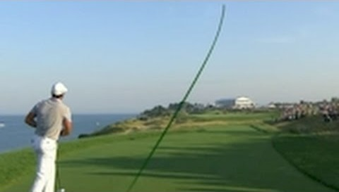
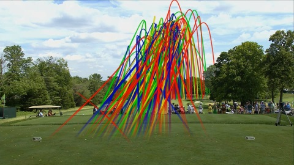
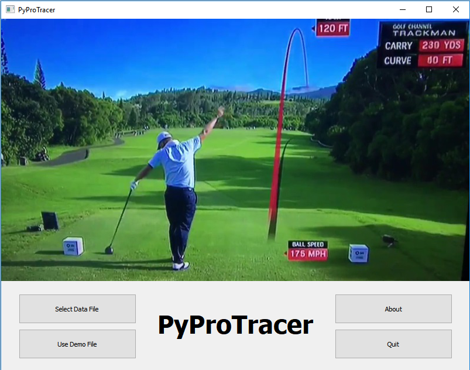
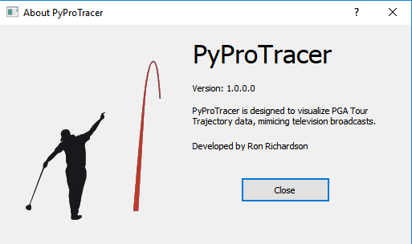
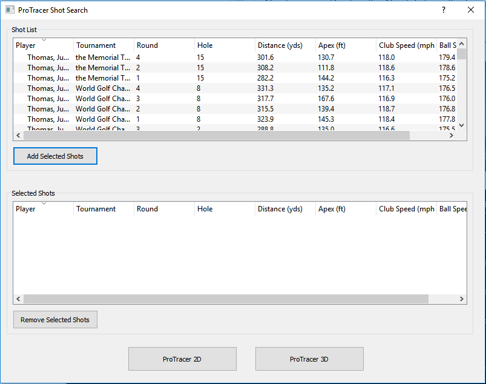

# PyProTracer

PyProTracer is an application built in Python 3.6.1 to visualize golf shot trajectories. This application was built for submission as Project #1 for DATA 520 at Mercyhurst University in the Fall 2017 term.

## ProTracer Examples

Each television network that broadcasts a PGA Tour event (or other golf tours like the European Tour) has their own version of ProTracer.  The idea is still the same with each, show the path of a golfer's shot as it's travelling through the air. 

** Single Shot Example **



** Multiple Shot Example ** 


## Shot Data

The data being used for this application comes from directly from the PGA Tour through their [ShotLink Intelligence program](https://www.pgatour.com/stats/shotlinkintelligence/overview.html). In August 2017, I applied for access to their data and was ultimately approved. 

The data exported from ShotLink we are looking at is the Radar Trajectory Data. Within this data, there are a few fields available that will assist in the visualization and plotting of each shot:

Name | Description
--- | ---
Trajectory Sequence # | The sequence the trajectory data was captured in
Trajectory X Coordinate | The X coordinate of the ball when captured (e.g. the distance away from the golfer)
Trajectory Y Coordinate | The Y coordinate of the ball when captured (e.g. the left to right curve of the ball)
Trajectory Z Coordinate | The Z coordinate of the ball when captured (e.g. the height of the ball)
Extrapolated | Y/N flag indicating if the data point is calculated or actual

There are several other fields available, such as Club Head Speed, Launch Angle, and Total Distance, but for the purposes of plotting the data, the X, Y, and Z coordinates are plenty.

## Installing the Application
### Required Modules

There are several Python modules required in order to run the application. 
* PyGt5
* Matplotlib
* Pandas
* Numpy

A requirements file is provided, so using pip should get the application ready to run.

```
pip install -r requirements.txt
```

## Running the Application

Once all the modules are installed, execute the ```app.py``` file using python from within the directory the files are located:

```
python app.py
```

## User Interface

The UI was built using the PyGt5 module. Each UI component was laid out using Qt Designer 5.6.2 and then compiled into Python files. Hand coding the UI would be very tedious, so this application has proved very useful.

There is a simple About dialog box showing application information and has no other functionality.  Finally, the protracer dialog is where all the magic happens. This dialog is where the user selects a golfer, tournament, and the shots to plot. Along with the plot, statistics for each shot is displayed as well.

### Main Window

The main window is the first the user sees. This window contains the main functions available to the user.

Button | Description
--- | ---
Select Data File | Allows the user to select their own data file for use in the application. The file must be formatted the same way as the PGA Tour ShotLink data.
Load Demo File | Automatically loads a small demo file with 4 golfers and their shots for 2017.
About | Displays the About dialog with information about the application
Quit | Exits the application



### About Dialog

The about dialog shows the user the current build information, developer, and a quick description of the application.



### ProTracer Dialog

The protracer dialog is where the user will select the shots to visualize and see statisical data for the shot(s).



#### Credits
About Dialog image credit: [No Laying Up](http://www.nolayingup.com/)


#### About the Author
Ron Richardson
Mercyhurst University Graduate Student
[Email](mailto:rricha67@lakers.mercyhurst.edu) / [LinkedIn](http://www.linkedin.com/in/rer145/)

